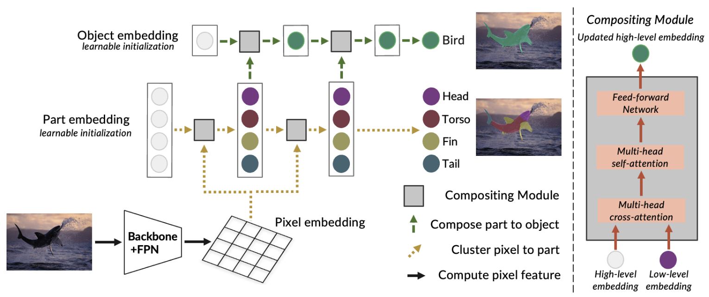

# Compositor: Bottom-Up Clustering and Compositing for Robust Part and Object Segmentation

This repo contains the data and code for our paper [**Compositor: Bottom-Up Clustering and Compositing for Robust Part and Object Segmentation**](https://arxiv.org/abs/2306.07404)

<div align="center">
  
</div><br/>

*Compositor* is a simple yet effective architecture for jointly segmenting parts and objects in a bottom-up process, which clusters pixel embedding to part embedding and further composites part embedding to obtain object embedding, thus achieving more consistent and robust segmentation results. We provide *Compositor* implemented based on two mask transformer architectures: MaskFormer and kMaX-DeepLab in this repo.

## Installation

See [Installation Instructions](INSTALL.md).

## Dataset Sources

- [PartImageNet](https://drive.google.com/file/d/1rZAECl3XF55NqJfW7Z9N63MFAvXupNuy/view?usp=sharing)
- [Pascal-Part](https://drive.google.com/file/d/162IWo6BmPXJek5Wfw-JautqKHZLBcgNY/view?usp=sharing)

## Getting Started

See [Preparing Datasets for Compositor](DATASETS.md).

See [Getting Started with Compositor](GETTING_STARTED.md).

## <a name="Citing Compositor"></a>Citing Compositor

If you use Compositor in your research, please use the following BibTeX entry.

```BibTeX
@InProceedings{He_2023_CVPR,
    author    = {He, Ju and Chen, Jieneng and Lin, Ming-Xian and Yu, Qihang and Yuille, Alan L.},
    title     = {Compositor: Bottom-Up Clustering and Compositing for Robust Part and Object Segmentation},
    booktitle = {Proceedings of the IEEE/CVF Conference on Computer Vision and Pattern Recognition (CVPR)},
    month     = {June},
    year      = {2023},
    pages     = {11259-11268}
}
```

## Acknowledgement

[Mask2Former](https://github.com/facebookresearch/Mask2Former)

[kMaX-DeepLab](https://github.com/bytedance/kmax-deeplab)